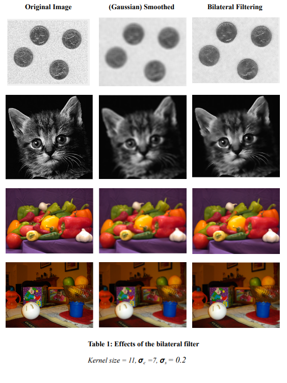

# BilateralFiltering
Bilateral Filtering Implementation, done as a team of two in Matlab, based on the "Bilateral Filtering for Gray and Color Images" paper by
C. Tomasi and R. Manduchi. 

The attached report provides a review of the paper, metrics and details of our implementation. An example of the effects of the bilateral filter we implemented is shown below:

References
[1] C. Tomasi and R. Manduchi, "Bilateral Filtering for Gray and Color Images",
Proceedings of the 1998 IEEE International Conference on Computer Vision, Bombay, India.
[2] Zhang X, Dai L. Fast bilateral filtering. Electronics letters. pp.:258-260, 2019
[3] Chaudhury, K.N.: ‘Acceleration of the shiftable O(1), algorithm for bilateral filtering
and nonlocal means’, Trans. Image Process.,pp. 1291–1300, 2013,
[4] Banterle, F.; Corsini, M.; Cignoni, P.; Scopigno, R.. "A Low-Memory,
Straightforward and Fast Bilateral Filter Through Subsampling in Spatial Domain". Computer
Graphics Forum. 2011
[5] Kornprobst, Pierre . "Limitations? - A Gentle Introduction to Bilateral Filtering
and its Applications". 2007
[6] He, Kaiming & Sun, Jian & Tang, Xiaoou.. “Guided Image Filtering”. IEEE
transactions on pattern analysis and machine intelligence. 2013
